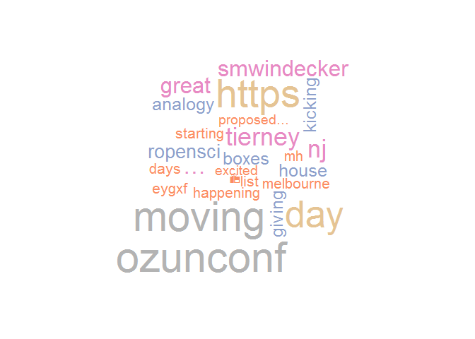

<!-- README.md is generated from README.Rmd. Please edit that file -->

# simpletextr

The goal of simpletextr is to create simple Natural Language Processing
functions that take care of the pre-processing and allow the user to
focus on the task and the output. This would be most useful where the
objective is to extract something from a vector of text.

There are some common NLP or text-mining tasks to begin with could be
entity extraction (people, places), keyword extraction and perhaps even
topic modelling or text classification.

The functions would all be self-descriptive so: `extract_place()`,
`extract_people()`, `extract_topics()` etc.

Inputs would be simple vectors of text and outputs a vector or list of
the same length. So this could easily slot into a tidy workflow:

``` r
df %>%
  mutate(keywords = extract_keywords(text_column))
```

The most complex part of NLP is the pre-processing. But I suspect (hope)
it would be possible to setup a robust and generic process. And I think
for 90% of use cases a generic pre-processing with only a few options
would be sufficient.

The question I have is whether or not something like this already
exists, I will check.

## Installation

You can install the released version of simpletextr from
[Github](https://github.com/ropenscilabs/simpletextr) with:

``` r
devtools::install_github("ropenscilabs/simpletextr")
```

## Simple Cleaning

This is a basic example which shows you how to clean a small twitter
dataset from `#ozunconf18`:

``` r

library(simpletextr)

text <- ozunconf18_tweets$text

cleaned <- clean_text(text, stop_words = 'rt')
```

Now we can see the difference between a raw tweet:

> RT @fidlerfm: Excited about tomorrow’s talk by Franca Agnoli on
> failures to replicate stereotype threat effects in girls’ mathematics
> perfo…

and the same tweet cleaned:

> fidlerfm excited tomorrows talk franca agnoli failures replicate
> stereotype threat effects girls mathematics perfo…

## Simple Outputs

### Term Table

``` r

tt <- term_table(cleaned)
```

| term     | count |
| :------- | ----: |
|          |    26 |
| ozunconf |    24 |
| moving   |    23 |
| https    |    22 |
| day      |    21 |
| nj       |    13 |

### Wordcloud

``` r

wordcloud::wordcloud(tt$term, tt$count, col = RColorBrewer::brewer.pal(8, 'Set2'), min.freq='5')
```



## Comparison with Tidytext

After reading [Text Mining with R](https://www.tidytextmining.com/) it
appears many of the objectives of this package are already met by the
`tidytext` package. There is still some value in a package such as
`simpletextr`. But better understanding of current tools is required for
this value to be identified.

### ozunconf18 Tweets

``` r

library(dplyr)
library(tidytext)
library(stringr)

tv <- ozunconf18_tweets %>%
  unnest_tokens(word, text, token = 'tweets') 

tidy_tt <- term_table(tv$word)

wordcloud::wordcloud(tidy_tt$term, tidy_tt$count, col = RColorBrewer::brewer.pal(8, 'Set2'), min.freq='5')
```


